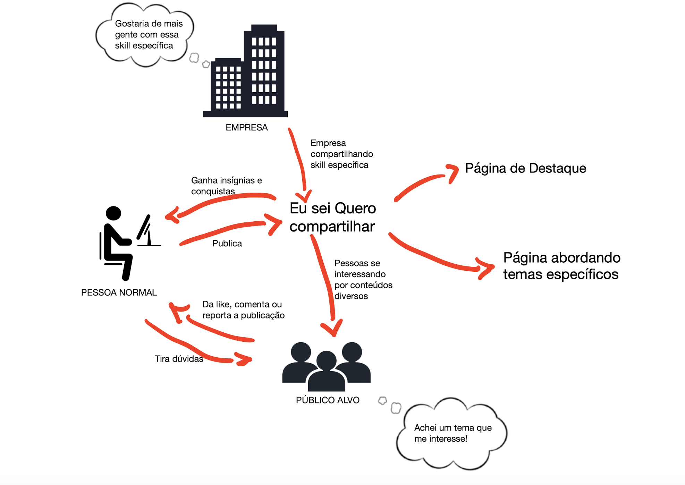

## Introdução

O Sketch é a etapa em que cada integrante da equipe expressa suas ideias por meio de desenhos, com base no que foi definido anteriormente na etapa do Unpack. O objetivo é representar visualmente soluções possíveis, levando em conta a visão individual de cada participante. Mesmo quem não tem habilidades com desenho é incentivado a contribuir. Para padronizar a representação, utiliza-se o formato de Rich Pictures, onde cada pessoa cria o modelo, de acordo com o escopo definido.

## Metodologia

Para melhor visualizar e estruturar o funcionamento do nosso projeto, empregamos a técnica de Rich Picture. Utilizamos o aplicativo GoodNotes como plataforma principal, que funcionou como um canvas digital intuitivo, permitindo-nos esboçar livremente todas as ideias e conceitos relevantes de forma colaborativa. Essa abordagem facilitou a organização e o alinhamento das informações entre os membros da equipe, transformando conceitos abstratos em representações visuais claras e eficazes.

Nesta Página está apenas o Rich Picture final. Para ver todas as RichPictures desenvolvidas, veja: [Rich Pictures](1.2.3.RichPicture.md) 

## Rich Picture

Figura 1: Rich Picture FInal (Fonte: João Paulo Monteiro)

## Referência

> SERRANO, Milene. *Arquitetura e Desenho de Software*. AULA - PROJETO E DESENHO DE SOFTWARE. Apresentação em Slide, 49 Slides, p 44. Disponível em: https://aprender3.unb.br/pluginfile.php/3070928/mod_page/content/5/Arquitetura%20e%20Desenho%20de%20software%20-%20Aula%20Projeto-DSW%20-%20Profa.%20Milene.pdf. Acesso em: 10/04/2025.

> SERRANO, Milene. *Arquitetura e Desenho de Software*. AULA - PROJETO E DESENHO DE SOFTWARE. Apresentação em Slide, 49 Slides, p 14-17. Disponível em: https://aprender3.unb.br/pluginfile.php/3070928/mod_page/content/5/Arquitetura%20e%20Desenho%20de%20software%20-%20Aula%20Projeto-DSW%20-%20Profa.%20Milene.pdf. Acesso em: 10/04/2025.

## Histórico de versão:

| Versão | Alteração                  | Responsável     | Revisor | Data       | Detalhes da Revisão |
| -      | -                          | -               | -       | -          | -                   |
| 1.1    | Alteração da introdução e hyperlinkagem das Rich Pictures | [Rodrigo Gontijo](https://github.com/rodrigogontijoo)| | 10/04/2025 | |
| 1.0    | Elaboração do documento | [João Paulo Monteiro](https://github.com/joaombc) | | 10/04/2025 | |