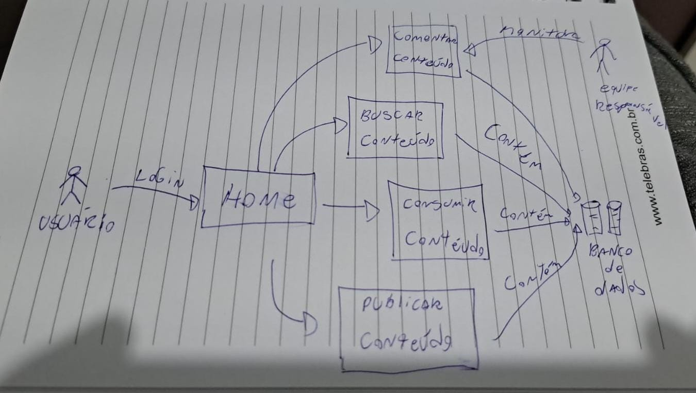
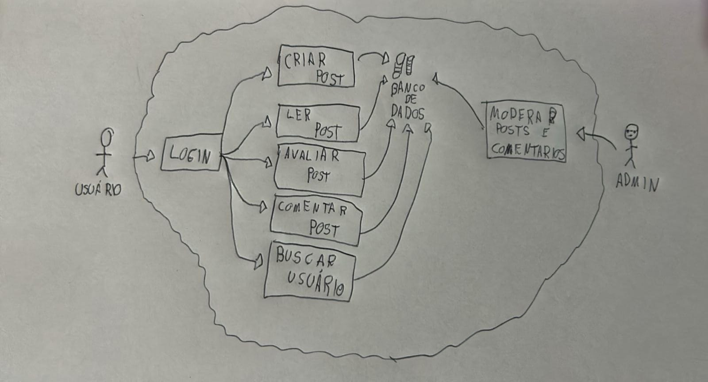
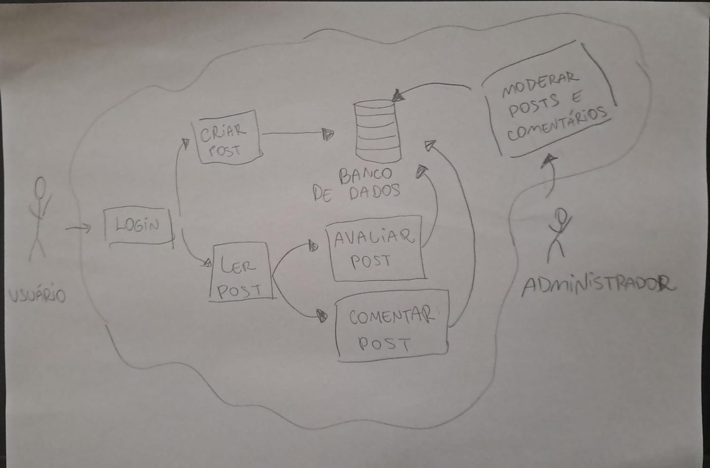
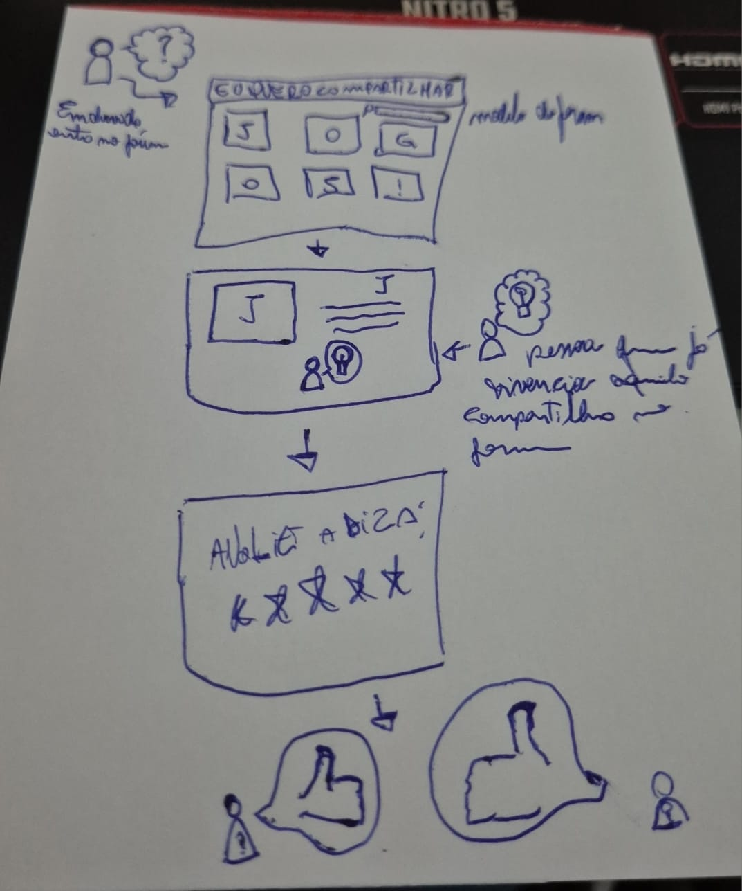
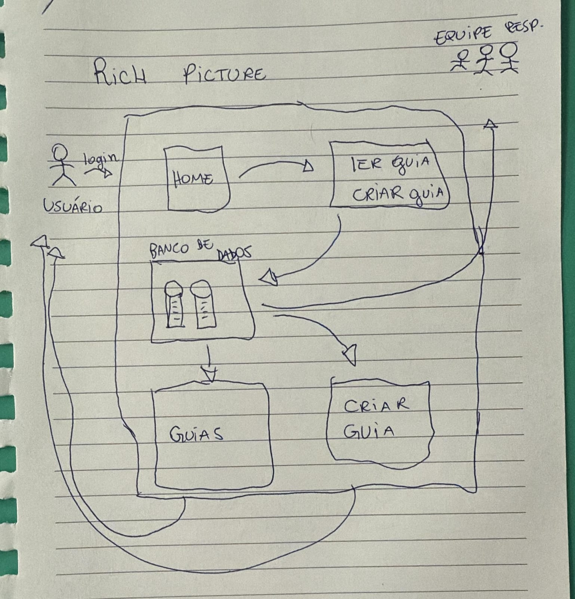

## Introdução

O Rich Picture é uma técnica visual que utiliza desenhos e textos curtos para representar ideias e processos de forma simplificada [(SERRANO)](#referência). Essa abordagem colaborativa é especialmente útil em reuniões com clientes e equipes de desenvolvimento, pois facilita o entendimento de conceitos complexos e o alinhamento entre os envolvidos. Por sua natureza dinâmica e informal, o Rich Picture se mostra eficaz nas etapas iniciais de projetos, auxiliando na identificação de requisitos e na modelagem de soluções.

Neste projeto, a utilização de Rich Pictures se deu em duas fases; na fase 2 da Design Sprint, Sketch, seu uso foi dividido em Rich Pictures individuais, a partir dos quais seria acordado o melhor modelo na fase 3 da Design Sprint, Decide, resultando no desenvolvimento de uma Rich Picture final relativa ao projeto.  

## Metodologia

No projeto, o [Unpack](1.1.1.Unpack.md#111-entender-unpack) foi realizado em grupo, mas as etapas foram todas divididas a serem documentadas em duplas. Este caso não seguia o ideal da Design Sprint, a qual requer que no mínimo, as etapas 1 a 3 - Unpack, Sketch e Decide - sejam realizadas em grupo. Para efetivar a correção, as Rich Pictures individuais foram desenvolvidas em 10/04/2025 e coletadas neste arquivo, para então serem escolhidas e ranqueadas no Decide.

## Rich Pictures Individuais

Figura 1: Rich Picture de [Fernando Gabriel](https://github.com/show-dawn)

Figura 2: Rich Picture de [Henrique Galdino](https://github.com/hgaldino05)

Figura 3: Rich Picture de [Igor Thiago](https://github.com/Igor-Thiago)

Figura 4: Rich Picture de [João Paulo Monteiro](https://github.com/joaombc)

Figura 5: Rich Picture de [Júlio Cesar](https://github.com/Julio1099)

Figura 6: Rich Picture de [Matheus Ferreira](https://github.com/matferreira1)

Figura 7: Rich Picture de [Rodrigo Orlandi](https://github.com/orlandirodrigo)

Figura 8: Rich Picture de [Rodrigo Gontijo](https://github.com/rodrigogontijoo)

Figura 9: Rich Picture de [Vitor Pereira](https://github.com/vcpVitor)

Figura 10: Rich Picture de [João Victor](https://github.com/jmarquees)

## Referência

> SERRANO, Milene. *Arquitetura e Desenho de Software*. AULA - PROJETO E DESENHO DE SOFTWARE. Apresentação em Slide, 49 Slides, p 14-17. Disponível em: https://aprender3.unb.br/pluginfile.php/3070928/mod_page/content/5/Arquitetura%20e%20Desenho%20de%20software%20-%20Aula%20Projeto-DSW%20-%20Profa.%20Milene.pdf. Acesso em: 10/04/2025.

## Histórico de versão:

| Versão | Alteração                  | Responsável     | Revisor | Data       | Detalhes da Revisão |
| -      | -                          | -               | -       | -          | -                   |
| 1.2    | Adicionar detalhes na Introdução e Metodologia | [Rodrigo Orlandi](https://github.com/orlandirodrigo) | - | 11/04/2025 | |
| 1.1    | Adição Rich Pictures Restantes | [Rodrigo Gontijo](https://github.com/rodrigogontijoo)| | 11/04/2025 | |
| 1.0    | Elaboração do documento |  [Rodrigo Gontijo](https://github.com/rodrigogontijoo), [João Paulo Monteiro](https://github.com/joaombc) e [Rodrigo Orlandi](https://github.com/orlandirodrigo) |  | 10/04/2025 | |