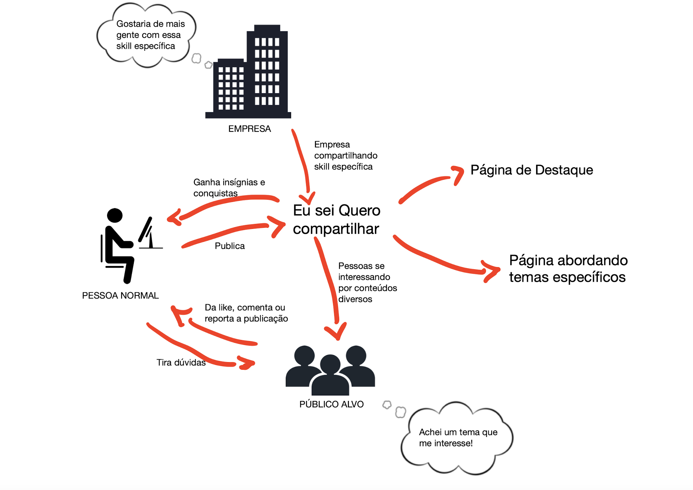

## Introdução

O Rich Picture é uma técnica visual que utiliza desenhos e textos curtos para representar ideias e processos de forma simplificada. Segundo Serrano, essa abordagem colaborativa é especialmente útil em reuniões com clientes e equipes de desenvolvimento, pois facilita o entendimento de conceitos complexos e o alinhamento entre os envolvidos. Por sua natureza dinâmica e informal, o Rich Picture se mostra eficaz nas etapas iniciais de projetos, auxiliando na identificação de requisitos e na modelagem de soluções.

## Metodologia

## Rich Pictures

## Referência

> SERRANO, Milene. *Arquitetura e Desenho de Software*. AULA - PROJETO E DESENHO DE SOFTWARE. Apresentação em Slide, 49 Slides, p 14-17. Disponível em: https://aprender3.unb.br/pluginfile.php/3070928/mod_page/content/5/Arquitetura%20e%20Desenho%20de%20software%20-%20Aula%20Projeto-DSW%20-%20Profa.%20Milene.pdf. Acesso em: 10/04/2025.

## Histórico de versão:

| Versão | Alteração                  | Responsável     | Revisor | Data       | Detalhes da Revisão |
| -      | -                          | -               | -       | -          | -                   |
| 1.0    | Elaboração do documento |  [Rodrigo Gontijo](https://github.com/rodrigogontijoo) e [João Paulo Monteiro](https://github.com/joaombc) | | 10/04/2025 | |