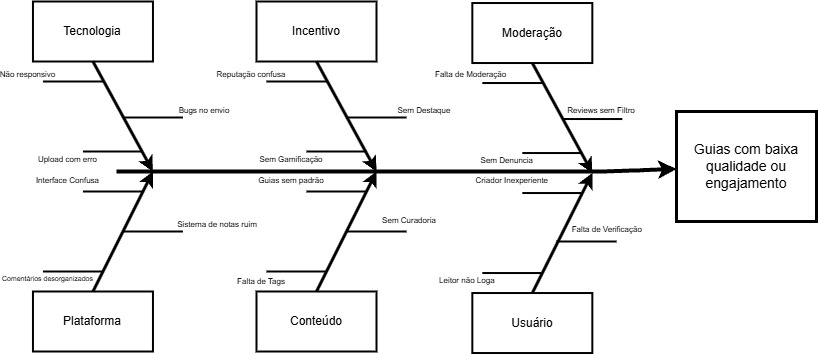

#  Mapa de Causas e Efeitos

## Introdução

O *Diagrama de Causa-Efeito, também conhecido como **Diagrama de Ishikawa* ou *Espinha de Peixe*, é um artefato visual utilizado para identificar e organizar as possíveis causas de um problema específico. Ele ajuda a entender os fatores que contribuem para um efeito central negativo, organizando-os em categorias e subcategorias de forma lógica e estruturada.

## Diagrama de Causa-Efeito

Como resultado da etapa [Unpack](/Base/1.1.1.Unpack.md), foi criado o seguinte diagrama de causa-efeito, que ilustra os principais motivos que podem levar à *baixa qualidade ou pouco engajamento dos guias* publicados na plataforma.  

As causas estão agrupadas nas seguintes categorias:

- *Usuário*: Refere-se ao comportamento e perfil dos criadores e leitores.
- *Conteúdo*: Relacionado à estrutura, curadoria e clareza dos guias.
- *Plataforma*: Envolve a interface, organização e usabilidade do sistema.
- *Moderação*: Ausência de filtros, denúncias ou controle de qualidade.
- *Incentivo*: Falta de elementos motivacionais como gamificação ou destaque.
- *Tecnologia*: Problemas técnicos, bugs ou falta de responsividade.

Cada uma dessas categorias apresenta causas específicas que, se não forem tratadas, podem impactar negativamente a experiência do usuário e a reputação da comunidade.

Figura 1 - Diagrama de Causa-Efeito (Fonte: Julio Cesar, Fernando Gabriel)

## Referências

SERRANO, Milene. *Arquitetura e Desenho de Software. AULA - PROJETO E DESENHO DE SOFTWARE.* Apresentação em Slide, 18 slides, p. [inserir páginas do conteúdo]. Disponível em: [slides](https://aprender3.unb.br/pluginfile.php/3070928/mod_page/content/5/Arquitetura%20e%20Desenho%20de%20software%20-%20Aula%20Projeto-DSW%20-%20Profa.%20Milene.pdf). Acesso em: 09/04/2025.

ISHIKAWA, Kaoru. *What is Total Quality Control? The Japanese Way.* Englewood Cliffs: Prentice-Hall, 1985.

INSTITUTE FOR HEALTHCARE IMPROVEMENT. *Diagrama de Causa e Efeito.* Disponível em: [https://www.ihi.org/sites/default/files/Diagrama-de-Causa-e-Efeito_Portugu%CB%86s.pdf](https://www.ihi.org/sites/default/files/Diagrama-de-Causa-e-Efeito_Portugu%CB%86s.pdf). Acesso em: 10 abr. 2025.

## Histórico de versão:

| Versão | Alteração                  | Responsável     | Revisor | Data       | Detalhes da Revisão |
| -      | -                          | -               | -       | -          | -                   |
| 1.0    | Elaboração do documento | [Júlio Cesar](https://github.com/Julio1099) e [Fernando Gabriel](https://github.com/show-dawn)| | 10/04/2025 | |
| 1.1    | Adiciona Referências | [Júlio Cesar](https://github.com/Julio1099) e [Fernando Gabriel](https://github.com/show-dawn)| | 10/04/2025 | |