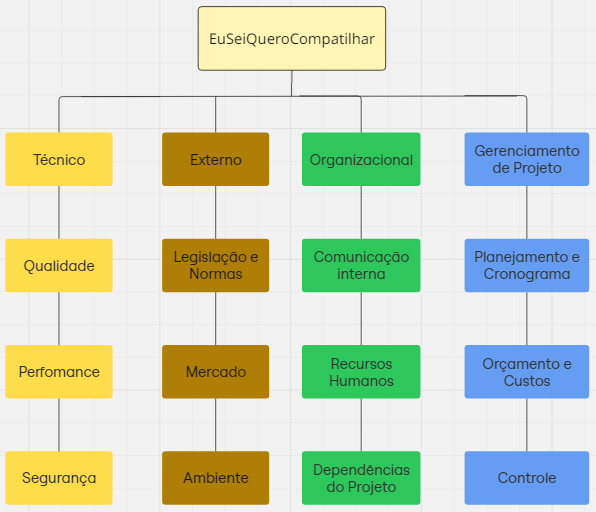

# 1.2.5. Plano de Gerenciamento de Riscos

## Introdução

Este documento visa estabelecer as diretrizes para a execução, monitoramento e controle do gerenciamento de riscos ao longo do projeto. Um risco é entendido como qualquer evento ou condição incerta que possa influenciar os objetivos do projeto, tanto de forma adversa quanto benéfica. Dessa maneira, distingui-se entre riscos que podem comprometer os resultados e oportunidades que, se materializadas, agregarão valor ao empreendimento. Para administrar esses riscos de forma eficaz, é essencial seguir um processo sistemático que abrange a identificação, as análises qualitativa e quantitativa, a definição de respostas adequadas e o monitoramento contínuo.

## Estrutura Analítica de Riscos (EAR)

Utilizando o diagrama abaixo, os riscos que podem impactar o projeto são organizados em quatro grandes categorias: Técnico, Externo, Organizacional e Gerenciamento de Projeto.

Figura 1 - EAR (Fonte: Igor Thiago, Henrique Galdino)

## Histórico de versão:

| Versão | Alteração                  | Responsável     | Revisor | Data       | Detalhes da Revisão |
| -      | -                          | -               | -       | -          | -                   |
| 1.0    | Elaboração do documento | [Igor Thiago](https://github.com/Igor-Thiago) e [Henrique Galdino](https://github.com/hgaldino05)| | 11/04/2025 | |