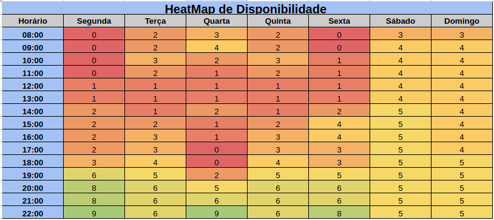
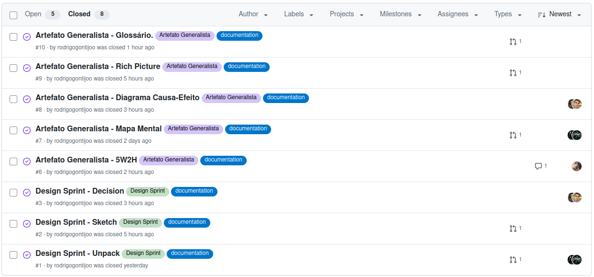

# 1.5. Iniciativas Extras (Base)

## Heatmap

O grupo desenvolveu um heatmap com o objetivo de encontrar o melhor horário para realizarmos nossas reuniões. Através da visualização gráfica dos dados de disponibilidade dos membros, conseguimos identificar os períodos em que a maioria estava livre. 

Decidimos que Segunda-Feira das 20:00 às 21:00 é o melhor horário para nos reunirmos. 

Acesso da planilha: [Heatmap](https://docs.google.com/spreadsheets/d/11hrpBMybRPjnWFFtlIbt_Z8uC3M4b6249Kwg9niy_0g/edit?gid=167832767#gid=167832767)

Figura 1 - Heatmap (Autor: Rodrigo Gontijo)

## Documentação de Issues

Com objetivo de manter claro quais tarefas ja foram realizadas, e quais precisam ser realizadas, foram criadas issues para cada atividade da entrega 1.

Acesso para as issues: [Issues](https://github.com/UnBArqDsw2025-1-Turma02/2025.1-T02-_G5_EuSeiQueroCompatilhar_Entrega_01/issues)

Figura 2 - Issues no github (Autor: Rodrigo Gontijo)

## Histórico de versão:

| Versão | Alteração                  | Responsável     | Revisor | Data       | Detalhes da Revisão |
| -      | -                          | -               | -       | -          | -                   |
| 1.0    | Elaboração do documento | [Rodrigo Gontijo](https://github.com/rodrigogontijoo)| | 11/04/2025 | |