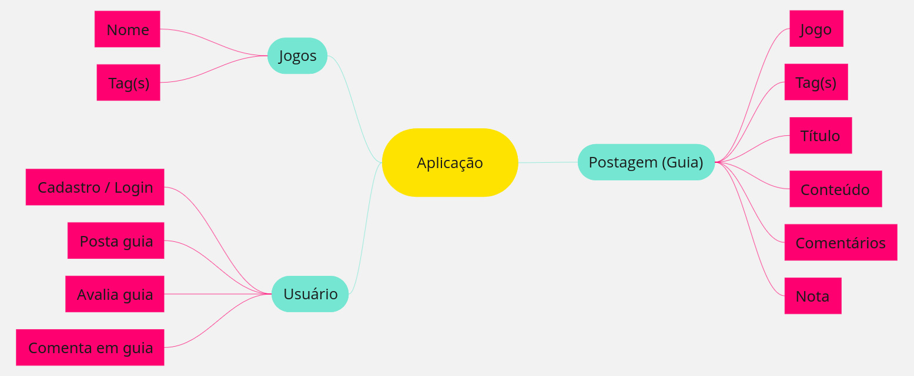

# 1.2.1. Mapa Mental

## Introdução

O mapa mental é um artefato visual utilizado para representar e organizar informações de forma hierárquica e associativa, partindo de um conceito central e ramificando-se em tópicos e subtópicos relacionados. 

## Mapa Mental

Como resultado da etapa [Unpack](/Base/1.1.1.Unpack.md), foi o criado o seguinte mapa mental, que ilustra as principais partes da aplicação.

Figura 1 - Mapa Mental (Fonte: Rodrigo Gontijo, Vitor Pereira)

## Histórico de versão:

| Versão | Alteração                  | Responsável     | Revisor | Data       | Detalhes da Revisão |
| -      | -                          | -               | -       | -          | -                   |
| 1.0    | Elaboração do documento | [Rodrigo Gontijo](https://github.com/rodrigogontijoo) e [Vitor Pereira](https://github.com/vcpVitor)| | 09/04/2025 | |